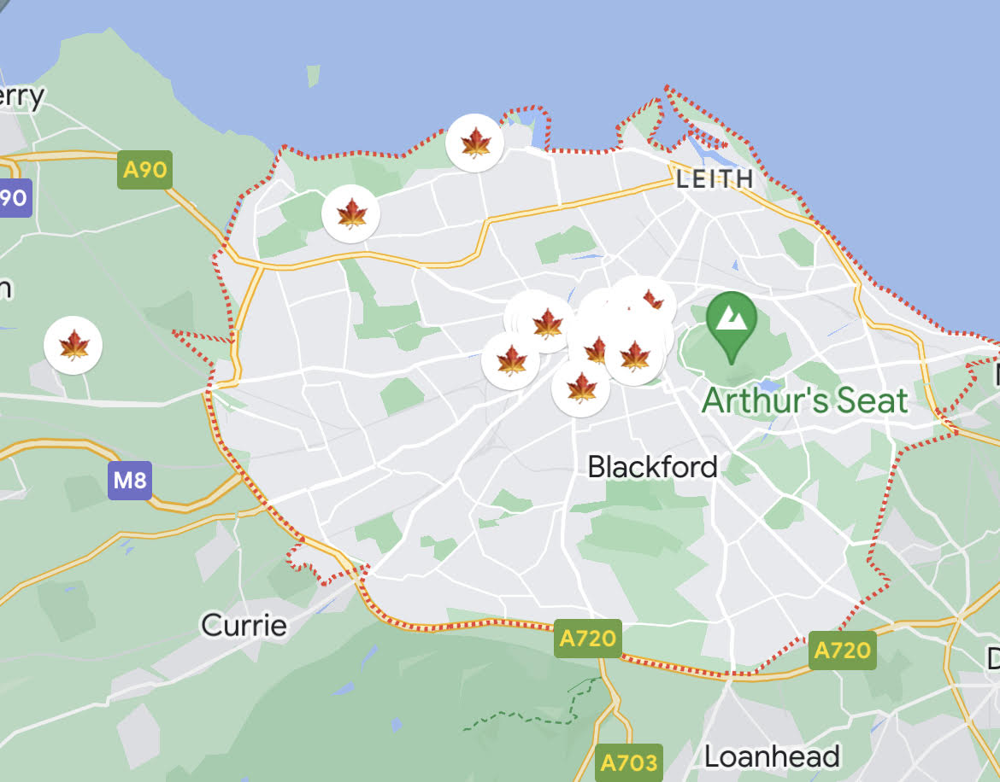

# How to Create a Solo Travel Itinerary

Last year, I decided that I would start challenging myself to go to three new countries every year. With solo travelling, I can choose my itinerary from start to finish, and I have so much flexibility. Solo travelling last year for the first time was a huge confidence boost, and I'm so excited to continue my journey to three countries per year. 

<!-- more -->

## Considerations

Solo travelling is empowering, especially when you cater the travel to your needs and limitations. 

* Health: what health limitations do you have, and how can you be prepared to address health concerns abroad?
* Financial: create a budget for fixed and flexible spending. Book your trips early, and stagger costs to accumulate items onto your itinerary. For example, purchase 2-3 activity passes or museum admissions per month leading up to your travel.
* Social: what social constraints may you encounter due to your personal identity while travelling? For example, are there any warnings you should heed about having tattoos in specific countries?
* Fear: what are your biggest fears about travelling solo and how can you address these and work through them with a qualified professional as your travel date comes?

## Choose Your Destination

If it's your first time ever solo travelling and you're anxious, you may want to travel some place where you can speak the language. For my first time solo travelling, I knew I could get around Belgium and France with my French. Plus, loads of people in Belgium and France speak some English. 

Once I'd decided I wanted to travel to Belgium and France, I choose my hubs, or the main cities that I would explore. I stick to cities because they have public transportation and many resources I could need to feel safer. For Belgium and France, I chose Brussels, Brugges, Antwerp, and Paris. However, I stayed only in Brussels. For my first time solo travelling internationally, I wanted to make it really easy on myself since I was nervous about transporting my luggage and the logisitics seemed complicated to me. 

This year, I'm going to England and Scotland. The language won't be a barrier. I decided on Edinburgh as my main hub, then London and Glasgow. I also opted for day trips to the Highlands and Stonehenge. I'll talk more about day trips in [Choose What To Do](#choose-what-to-do).

Since I'm feeling more confident about solo travelling, I'm packing extra light and moving around a bit more. This means I'll be staying in three cities - Edinburgh, London, and Glasgow. 

As you see, it's okay to take a trip to really start to get your bearings as a solo traveller and figure out how you want to travel. People travel at different paces. Some people love to stay in one place like I did in Brussels, and others must be constantly moving and seeing as much as possible. I think I'm a bit in the middle. I want to see a lot but I also want to experience the depth of being in a location for enough time to start to get comfortable.

## Book Your Travel and Stay

After I chose to go to Belgium and France, I booked a round trip flight to Brussels. Then I found an Aparthotel, which was very reasonably priced for the duration of my stay. An Aparthotel is a hybrid between an apartment and a hotel, so it'll have some additional amenities like laundry and a kitchenette. This worked well for me because I wanted to spend most of my days exploring and not eating out too much. So I bought groceries from a local shop and stored them in my kitchenette.

I booked all of my nights at [Aparthotel Adagio Brussels Grand Place](https://www.google.com/travel/search?q=aparthotel%20brussels&g2lb=2502548%2C2503771%2C2503781%2C4258168%2C4270442%2C4284970%2C4291517%2C4597339%2C4757164%2C4814050%2C4874190%2C4886480%2C4893075%2C4899571%2C4899572%2C4924070%2C4963887%2C4965990%2C4990494%2C10207532%2C72298667%2C72302247%2C72317059%2C72321071%2C72328734%2C72370226%2C72372542%2C72379816%2C72381178%2C72389535%2C72389536%2C72389675%2C72389680%2C72390424&hl=en-US&gl=us&ssta=1&ts=CAESABocEhoSFAoHCOcPEAoYExIHCOcPEAoYFBgBMgIQACoHCgU6A1VTRA&qs=CAEyE0Nnb0k1NnZab3FEXzdzRkhFQUU4CEIJCRdPYMmMi9Z7QgkJId--pCWaatRCCQmi2DKocPNuD0IJCedVVgT6u4NH&ap=aAG6AQhvdmVydmlldw&ictx=1&sa=X&ved=0CAAQ5JsGahcKEwjA_cabrO-BAxUAAAAAHQAAAAAQCw&utm_campaign=sharing&utm_medium=link_btn&utm_source=htls), which was right next door to the underground. This made it really easy for me to get to the main Brussels depot. 

After I booked my Brussels Apartotel, I knew I wanted to take a day trip to Paris to go to the Louvres, so I booked a round trip train ticket to and from Paris. I also booked a round trip train ticket to Antwerp for another day adventure.

For my UK trip this year, I booked a round trip to Edinburgh. Since I decided I would stay in more than Edinburgh, I next chose which cities I wanted to stay in. I booked my Edinburgh, London, and Glasgow hotels. This time, I did not book Aparthotels, since I now feel more comfortable eating out more while travelling. I chose the hotels based on their locations to activities and museums.

Then I booked my train tickets to travel between Edinburgh, London, and Glasgow.

## Choose What To Do

For my trip to Belgium and France, I created a list of museums and activities. My planning was a bit too unstructured for me, and I ended up spending more time than I wanted figuring out my itinerary on the fly. I learned with this trip that I prefer more planning. Overall, I left many "free days", which were the days I tackled my unordered list of museums. 

Outside of my free days, I had booked one day long excursion with a tour group to Brugges through Viator. This ended up being an incredible way to socialize and learn a lot about Belgium.

As I mentioned, I booked out to freeform day trips to Paris and Antwerp. My main goal in Paris was to go to the Louvres. In Antwerp, I went to two museums and wandered.

Now that I'm a bit more experienced as a solo traveller, I have created a much more robust itinerary for my UK trip. First, I researched the top museums, parks, and architectural places in Edinburgh, London, and Glasgow. I added those to a list that I would organize later. 

Then I went onto Viator and booked my main excursions and tours. Let's bring it all together in the next section.

## Build an Itinerary

With a list of museums, activities, excursions, and tours, I was ready structure it all into my itinerary. I started by typing it out in Google Docs. I structured it like the following:

1. List out all the dates individually
1. Add your flights
1. Add your hotel stays
1. Add your booked excursions and tours

This is your first version. There will be a lot more you'll add. 

Next, I went to Google Maps and pinned the following to three different lists (Edinburgh 2023, London 2023, and Glasgow 2023):

1. Airports
1. Hotels
1. Excursion and tour meeting places (add a note that describes why you saved this location)
1. Embassy and health centers, as applicable
1. Museums and other activities

After I pinned all of these items to my Google Maps, I found groupings, or museums and activities that were close together. This determined how I created my days. 

_On Google Maps mobile, you can even choose an emoji to represent your pins per list._

### Sample Day 

A sample Edinburgh itinerary could look roughly like the following:

August 30, 2023

* Writer's Museum (open 10AM-5PM)
* 7 minute walk via The Mound
* Scott's Monument (open 10AM-4:30PM)
* 19 minute walk to Edinburgh Books
* Old Town bookshops: Edinburgh Books and Armchair Books 

This type of itinerary provides me with my activities for the day, while also giving me lots of time to explore on my own. If I were travelling that day or moving hotels, I would add that, and schedule my activities around those events. 

Make sure to share your digital itinerary with a trusted individual in your home country.

## Revise and Keep a Paper Copy

I wrote and rewrote my itinerary until I was satisfied that I was going to do enough without getting exhausted. Not only did I type out my itinerary on Google Docs, but I also hand wrote it in my travel journal. See [Moving to a Traveler’s Notebook](../travelers-journal) to learn more about my journal setup. 

It was important to me to have a paper copy since I want to preserve my phone battery, and it's easier for me to read this way. It's also a nice keepsake for my travel journal that I can reflect back on after my trip.

There we go! I'm sure I'll learn so much more about travel planning during my upcoming trip.