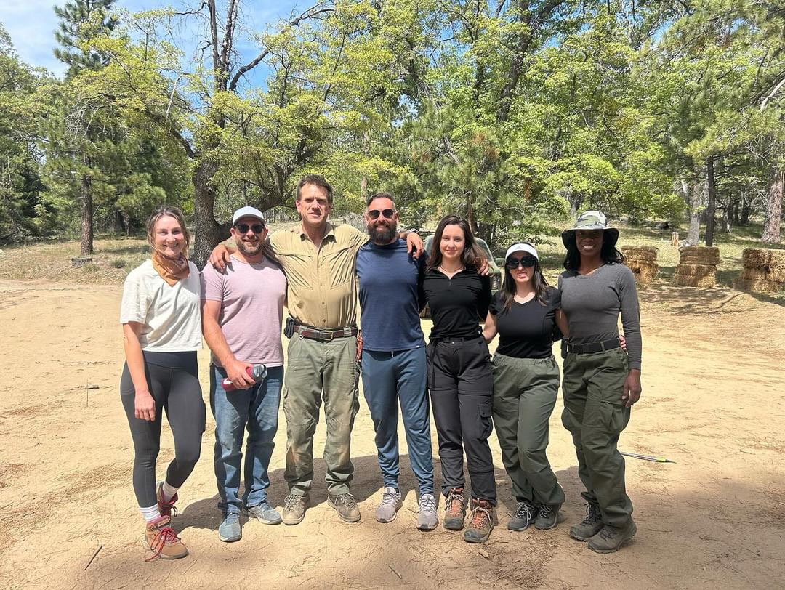
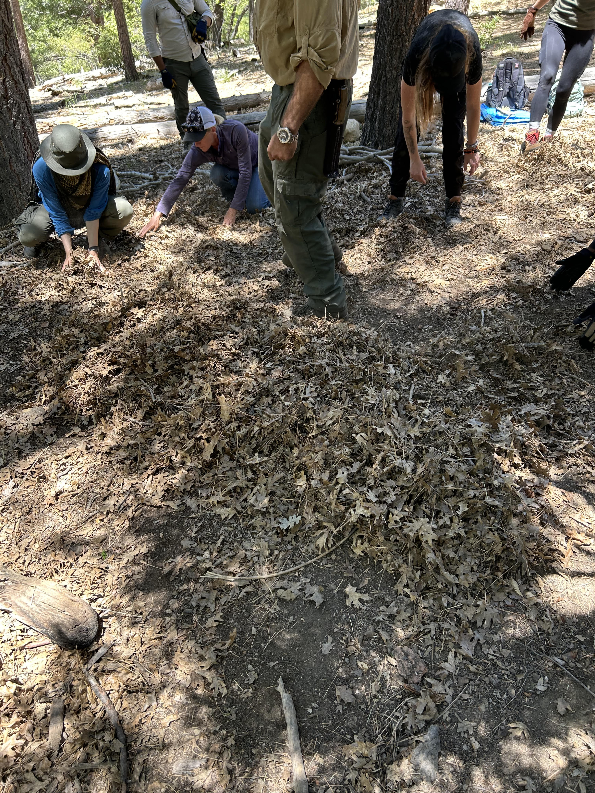
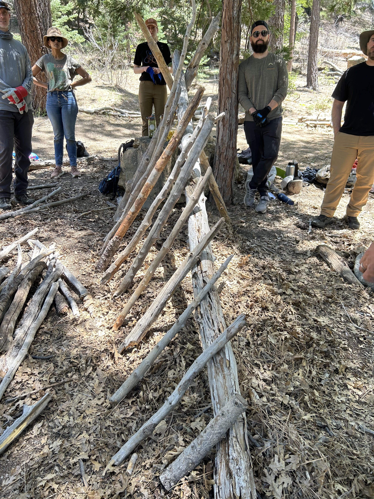
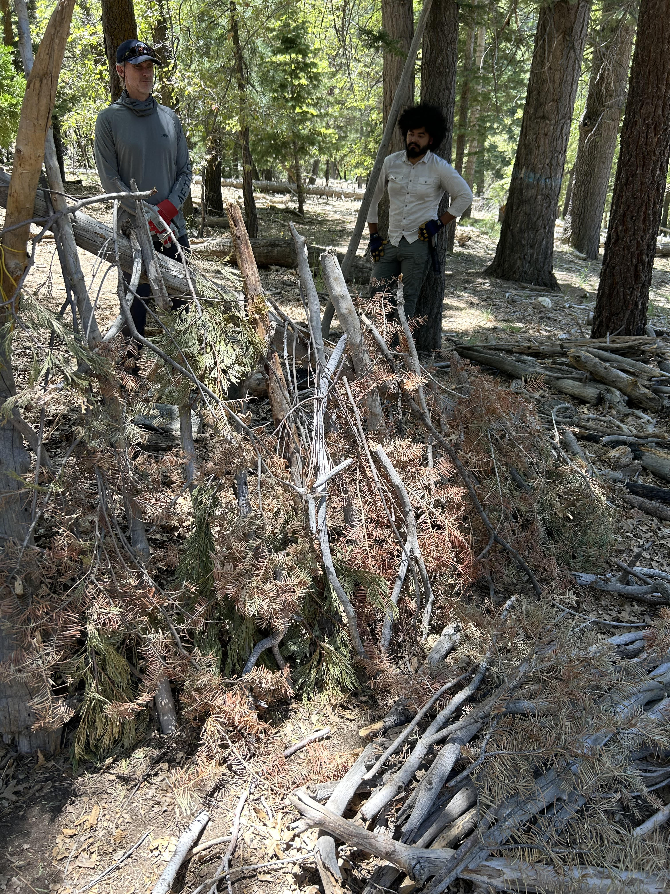
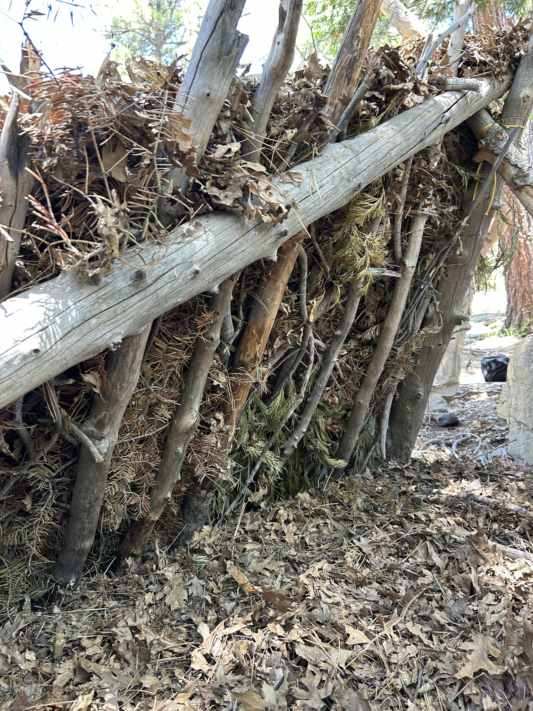

# Survival Training: Day One, Fire and Shelter

> This blog post is part of a series on survival training, written about the [Thomas Coyne Survival Skills Certification](https://www.californiasurvivaltraining.com/basic-survival-skills-certification-course) course. 

I just got back from a long and grueling three day survival training in Angelus Oaks, which is a less than two hour drive from Los Angeles. The city is nearby Big Bear, with an elevation of 5,800 feet (1,800 meters). I did this training through [Thomas Coyne Survival School](https://www.californiasurvivaltraining.com/), which works with the US Marine Corps, US Navy, US Department of Defense, and many more elite organizations. 

My fellow campers were not what I expected - most of the group was comprised of women around my age. It was incredible to be part of a group of like minded people who want to take responsibility into their own hands. And I loved being surrounded by people putting in the hard work to keep up and fully participate in every exercise. We had a great group. 

_Some of our group on the last day after we took our Red Cross certification test, including our instructor._

On day one, we reported to camp at 9AM and met our instructors, including our leader, Adam Mayfield. Adam has 30 years of experience, and started out in bushcraft. He instructs many of the school's different courses.  

## Building a fire with a starter

One of our first exercises was building a fire - an essential outdoor skill. We make a small teepee structure using dry pieces of wood coming together in a point, with a small platform underneath to get the starter closer to the top of the teepee. Then we crumbled a bit of fire starter cube in our hands and placed it on a flat piece of wood, and used a fero rod to light it. After that, we moved the starter to underneath the teepee. 

A fire is absolutely essential to outdoor survival. It's used for heat, cooking, and boiling water. When building a fire, have at least an hour's worth of wood ready to keep the fire going. If you're staying in an emergency shelter and need to keep the fire going overnight, keep your whole night's worth of wood within reach to feed the fire periodically throughout the night. 

## Building an emergency shelter

Exposure (heat, cold) is the top killer in the outdoors. Our main task for day one was building emergency shelters in small groups of 3-4 people. I was in a pairing but we still got quite a bit of our shelter built. An emergency shelter is meant to protect you from wind and other elements, and to keep you warm if you're stranded overnight or for several days. 

### Scouting a shelter location

Use the four Ws to find a good shelter location. 

**Wiggles**: Avoid making your shelter on top of an ant hill, around insect infected wood, and near any other insect hot spots.  

**Water**: Stay away from basins and run offs. You don't want to end up in a pool of water if it starts to rain. 

**Wind**: Your head should be facing the opposite side of where the wind is blowing from. 

**Widow maker**: If you shelter is around trees, look up for branches that are a falling hazard. If you can, pick pine over oak since oak can sometimes appear alive but be dead inside. 

### Building the structure

Building this shelter takes quite a bit of labor and can take hours, including the time it takes to source the right materials. That said, it's best to build one with other people. 

First, we gathered a huge pile of leaves, enough to make a thick mattress that would fit the amount of people in our group (since shelters are best used with two or more people to increase warmth from body heat). 

The mattress has to be longer than you think, because you'll lose some room from the A frame tapered down design. The mattress is critical as it insulates the ground, and you can stay warmer that way. This is why, when camping, you can feel a significant warmth difference if you sleep in a sleeping bag versus a sleeping bag on top of a sleeping mat. The image below was taken in progress of building a one person shelter, so the leaf pile is smaller than the ones we built in our teams. 

After we made our leaf mattress, we searched for a spine that was longer than the length of our mattress. Then we found two relatively equal length poles to make our A frame. We tied the two similar length poles to each other using paracord. Then we pulled the two tied poles into a large X shape, with a smaller triangle at the top to rest one side of our spine on. 

We secured the spine with weight and tested the strength of the gravity structure by pulling down on the front (note that the A frame should always be either sitting straight, or leaning toward the spine. If the A frame leans out, there's a higher chance of collapse). 

Once we completed our A frame structure, we found some straight sticks, and added ribs to each side of the spine by leaning them against the spine. This made up what I call the skeleton of the structure. The image below shows how the shelter looks from the back, which is the opposite of the opening. 

Once we built out the skeleton and knew that it could withstand some weight, we found some crooked branches and pine branches with wide coverage. This served as our next layer, and would be enough to support leaf "bricks" without the leaves all falling into the shelter.

The final step was gathering a huge amount of leaves using a tarp to make "bricks". To make the bricks, we gathered a big pile in our hands, packed it in with pressure, and set the brick down, building up row by row until we covered the whole structure. This part took the most amount of time due to the sheer amount of material we had to source and bring back to our structure.  

### Water treatment

Our next lesson was on water treatment. We went down to the river, and learned how to use a Sawyer mini to filter non-urban water. We also learned about boiling as a method to treat water, and using iodine and other tablets. For now, I've opted to stock up on tablets for my [Everest Base Camp](/im-climbing-to-mount-everest-base-camp/) trek coming up. I may choose to obtain a Sawyer mini as an alternative water treatment method.

### End of day one

While we covered fire basics, building an emergency shelter, and water treatment, we also learned an incredible amount of one-off lessons throughout the day. It was long, hard, and so rewarding. We ended the night with a community fire at the fire pit, where Adam showed us how to use rocks and a ziplock bag to boil water in an emergency. 