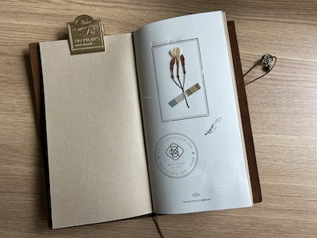
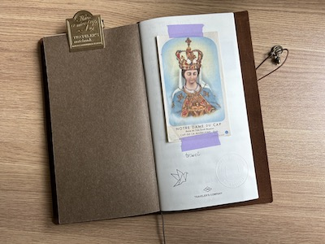
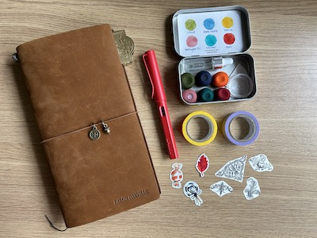
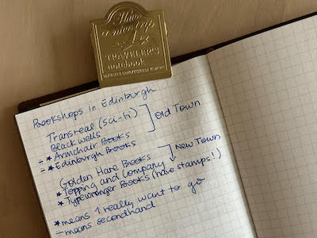

# Moving to a Traveler’s Notebook

Since graduating college, I’ve used Moleskine notebooks and planners. My most used Moleskine notebooks are the Classic Collection squared hard cover and soft covers, and the large yearly planner. I was using the notebooks for Morning Pages mainly, and the planner for my day-to-day tasks. However, I found that I wasn’t as motivated to write, and that part of it was the pressure of the large page, and of wanting to use the notebook for more than Morning Pages.

<!-- more -->

I discovered a new type of journaling, Commonplace, which I wanted to try. A Commonplace book is a catch all journal where you can compile many different types of writing, from journaling to reading notes to quotes, and pasted images, and other ephemera (such as ticker stubs). My book currently includes collages, quotes from books I’ve read, reading notes, lists, and poems.

My discovery of the Commonplace Book led me to another thought – since I was unmotivated to use my larger notebooks right now – why not try a different format of journaling. Maybe then I would have more flexibility and feel like I could use the journal for any format. I wanted to try a Traveler’s Notebook by the Traveler’s Company (not sponsored, just a fan).

A Traveler’s Notebook is a smaller leather covered folio that you add inserts to. It’s highly customizable, and there are many different types of inserts available – from planner formats, to different types of paper – including watercolor paper.

My Traveler’s Notebook is the camel regular size and contains three inserts:

* Planner (Free Diary Weekly and Memo Refill): for day-to-day planning and to do lists
* Commonplace (Kraft Paper Notebook Refill): for notes on any topics that interest me at the time
* Travel (Grid Notebook Refill):  for itineraries, travel journaling, and packing lists

There’s quite a large community around Traveler’s Notebooks, and many people post content in blogs and on Youtube describing how they use their journals. Some are artistic, and others more minimal. All are fascinating. I recommend finding inspiration online for your own set up.

Some considerations for your own Traveler’s Notebook set up:

* How often do you want to use your journal? If you want to use it daily, consider adding a planner insert. If the journal is meant to be a keepsake, you may opt for an insert that you’ll use for collages or travel memories.
* How do you currently write? Think about the way you currently write and why you write. Maybe you’re a list keeper. Consider a lined insert and compile your lists in one place.

The following images are of my Traveler’s Journal. 

   
